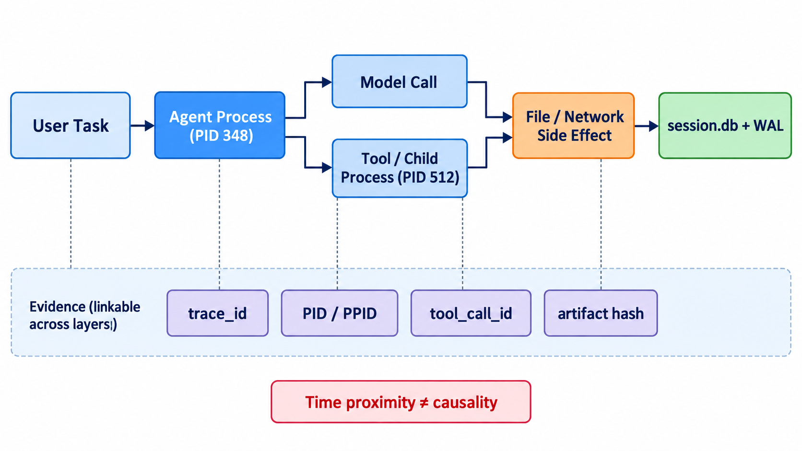

# 练习与验收答案：计算机系统与工程基础

> 本文是参考解，不是唯一答案。先独立完成，再用本文校正。`VERIFIED` 表示可由本项目文件或数据库直接核验；“教学示例”不能当作论文实验结果。

## 一、练习参考解

### 1. 系统证据图

#### 标准图



图中上半部分表示实际执行与副作用链，下半部分表示跨层关联证据。读图时应从左向右区分“用户意图”“进程执行”“资源副作用”和“持久化记录”；虚线不是因果边，而是说明哪些 ID 可以帮助把不同观测层连接起来。红色警告强调：时间接近只能支持候选配对，不能独立证明因果关系。

```text
用户任务 task_id=T1
  │ HTTP/CLI；wall_time=10:00:00.100
  ▼
Agent 进程 pid=348, ppid=120
  ├─ model_call M1 ──HTTPS──> 模型端点
  ├─ tool_call C1 ──────────> 子进程 pid=512
  │                            ├─ read  input.txt
  │                            └─ write report.md
  └─ SQLite transaction ─────> session.db + session.db-wal
```

最小关联键应同时包含 `session_id/trace_id`、`pid/ppid`、`tool_call_id` 和时间区间。时间邻近只能产生候选关系，不能单独证明因果。推荐证据表：

| 边 | 首选证据 | 退化证据 | 置信度风险 |
|---|---|---|---|
| 用户任务→Agent | 显式 `session_id` | 时间窗口 | 并发串线 |
| Agent→子进程 | `pid/ppid` + 启动时刻 | 命令行相似 | PID 复用 |
| Agent→工具 | `tool_call_id` | 工具名+时间 | 重试重复 |
| 工具→文件/网络 | 系统调用/审计事件 | 应用日志 | 日志遗漏 |
| 请求→响应 | request id | 同连接+次序 | 流式/并发错配 |

### 2. 五条 SQLite 查询

以下查询适配本项目 `session.db` 的已核验表结构。时间字段以毫秒计。

```sql
-- (1) 各表行数；SQLite 不支持把表名参数化，因此显式 UNION。
SELECT 'process_nodes' AS table_name, COUNT(*) AS n FROM process_nodes
UNION ALL SELECT 'tool_calls', COUNT(*) FROM tool_calls
UNION ALL SELECT 'llm_calls', COUNT(*) FROM llm_calls
UNION ALL SELECT 'token_usage', COUNT(*) FROM token_usage;

-- (2) 事件时间范围，并同时报告空时间戳数量。
SELECT MIN(start_timestamp_ms) AS min_ms,
       MAX(COALESCE(end_timestamp_ms, start_timestamp_ms)) AS max_ms,
       SUM(start_timestamp_ms IS NULL) AS missing_start
FROM llm_calls;

-- (3) 进程树边。不要只看 PID；保留启动时间以防 PID 复用。
SELECT c.id, c.pid, c.ppid, c.start_timestamp_ms,
       p.id AS parent_row_id, p.comm AS parent_comm
FROM process_nodes c
LEFT JOIN process_nodes p
  ON p.pid = c.ppid
 AND p.start_timestamp_ms <= c.start_timestamp_ms
 AND (p.end_timestamp_ms IS NULL OR p.end_timestamp_ms >= c.start_timestamp_ms)
ORDER BY c.start_timestamp_ms;

-- (4) 失败或异常工具调用。
SELECT id, tool_name, tool_call_id, status, duration_ms, output_json
FROM tool_calls
WHERE COALESCE(status, '') NOT IN ('ok', 'success', 'completed')
   OR output_json IS NULL
ORDER BY start_timestamp_ms;

-- (5) LLM 调用与 token 记录的候选关联；先查看真实外键，再决定最终 JOIN。
SELECT l.id AS llm_id, l.model, l.status,
       t.id AS token_row_id, t.*
FROM llm_calls l
LEFT JOIN token_usage t
  ON t.llm_call_id = l.id;
```

若本地 `token_usage` 没有 `llm_call_id`，第 (5) 条必须改用该表真实字段；不能为了让查询运行而臆造连接键。可先执行 `PRAGMA table_info(token_usage);`。这正是数据工程中的“schema-first”原则。

### 3. `session.db`、`-wal`、`-shm`

- `session.db` 是主数据库文件。
- WAL 模式下，提交的新页先追加到 `session.db-wal`，之后 checkpoint 才合并回主库。
- `session.db-shm` 是共享内存索引，帮助同机进程协调 WAL 读取与锁。

因此只复制主库可能漏掉尚未 checkpoint 的已提交事务。规范取证方法是：停止写入后用 SQLite backup API，或在同一时点成组保留三个文件；不能在写入进行中随意拼接不同时间点的文件。

### 4. 并发请求与“最近时间配对”反例

教学示例：请求 A 在 0 ms 发出、耗时 900 ms；请求 B 在 100 ms 发出、耗时 100 ms。响应顺序为 B(200 ms)、A(900 ms)。若算法把每个响应配给“最近的未匹配请求”，B 可能正确，但在流式、多连接重试或多个同名模型调用下会产生歧义。更强的配对顺序是：显式 request id > trace/span context > 同一连接的协议序号 > 进程与时间约束 > 单纯最近时间。

## 二、验收问题参考答案

1. **PPID 能证明什么？** 它能支持操作系统层面的父子创建关系；不能证明父进程在语义上“指示了”某项业务任务，也不能排除 PID 复用、容器命名空间或守护进程重新托管。需要启动时间、命令行和任务 ID 交叉验证。
2. **三类时钟如何用？** wall clock 便于跨日志阅读但会受 NTP/时区影响；monotonic clock 适合单机计算时长但不能直接跨机比较；跨机时间需要同步误差估计，最好依靠 trace context 和逻辑顺序而非只靠时间戳。
3. **重试为何会重复副作用？** 客户端可能在服务端已执行、但响应丢失时重发。幂等键应绑定“业务操作”，服务端原子地保存键、参数摘要与结果；同键同参数返回旧结果，同键异参数拒绝。HTTP 方法的协议幂等性也不自动保证业务实现正确。
4. **WSL2 eBPF 静默失败怎么查？** 检查内核版本/配置、BTF、权限与 capability、挂载点、目标进程是否真的在该内核/命名空间、探针 attach 结果、ring buffer 丢包统计；最后用一个已知会触发的最小系统调用做阳性对照。无事件不等于无行为。

## 三、评分标准（100 分）

| 项目 | 分值 | 满分条件 |
|---|---:|---|
| 系统图与边界 | 25 | 进程、网络、文件、数据库齐全，关联键明确 |
| SQL | 30 | 可运行、处理空值、说明 JOIN 假设 |
| WAL 解释 | 15 | 正确说明提交、checkpoint 与一致性复制 |
| 并发反例 | 15 | 给出可复现时间线并解释误配 |
| 证据边界 | 15 | 明确“观察到”与“证明了”的差别 |

低于 70 分应重做；若 SQL 使用了不存在字段但未声明假设，本章不能通过。

## 四、拓展与权威资料

- [SQLite Write-Ahead Logging](https://www.sqlite.org/wal.html)：WAL、checkpoint 与 `-shm` 的官方说明。
- [RFC 9110 §9.2.2](https://www.rfc-editor.org/rfc/rfc9110.html#section-9.2.2)：协议层幂等与自动重试的边界。
- [W3C Trace Context](https://www.w3.org/TR/trace-context/)：跨服务传播 `traceparent`/`tracestate` 的标准。
