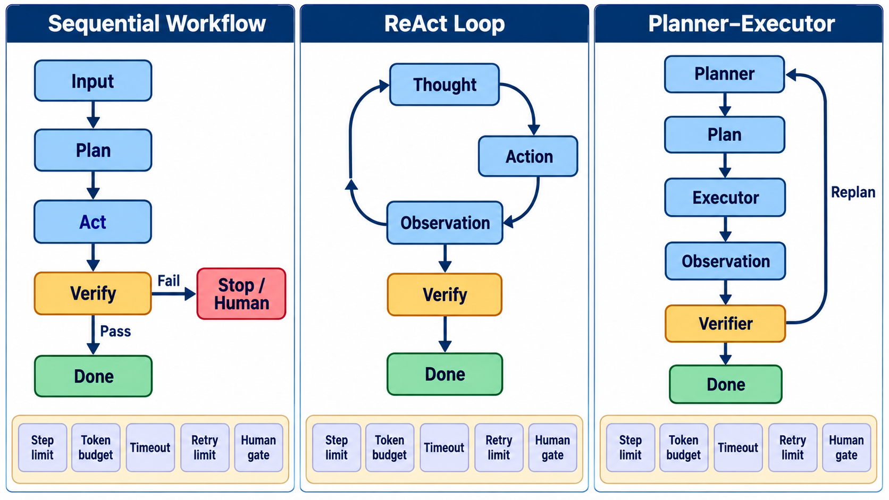

# 练习与验收答案：单 Agent 核心机制

## 一、练习参考解

### 1. “搜索并总结”事件分解

```text
Run R1
├─ Step S1 理解目标
│  └─ ModelCall M1 -> 查询词、约束、完成条件
├─ Step S2 搜索
│  ├─ ToolCall T1(search) -> Observation O1(候选来源)
│  └─ ToolCall T2(open)   -> Observation O2(正文/错误)
├─ Step S3 证据核验
│  └─ ModelCall M2 -> Claim-Evidence 表
├─ Step S4 写摘要
│  └─ ModelCall M3 -> draft
└─ Outcome: 环境校验引用可访问、主张受支持、格式合格
```

`Outcome` 不应由模型一句“已完成”直接赋值。它应来自可执行检查或独立验收器。一个 Step 可以包含多个 model/tool call；边界应由“状态转换或可独立评价的子目标”定义，而不是每条聊天消息。

### 2. 三种控制结构

#### 标准图



这张图的判分重点不是视觉样式，而是状态与回边是否正确：顺序工作流只有预设分支；ReAct 的核心是 `Thought–Action–Observation` 闭环；Planner–Executor 在验证失败后回到 Planner 进行重规划。每个结构都必须同时声明步数、Token、超时、重试和人工门禁，否则循环结构没有可执行的终止语义。

| 结构 | 状态转移 | 优点 | 主要失败 |
|---|---|---|---|
| 顺序 workflow | `S1→S2→S3→S4` | 可预测、易审计 | 中途变化适应差 |
| ReAct | `Thought→Action→Observation` 循环 | 边执行边修正 | 循环、短视、上下文膨胀 |
| Planner–Executor | Planner 产计划，Executor 执行，Verifier 反馈 | 分工清晰、可重规划 | 计划陈旧、接口损失 |

同一任务若来源固定且验收明确，顺序 workflow 已足够；如果搜索结果未知，可在搜索阶段局部使用 ReAct，而非把整个流程都做成开放循环。

### 3. 预算设计

```yaml
budget:
  max_steps: 12
  max_model_calls: 8
  max_tool_calls: 15
  max_input_tokens: 30000
  max_output_tokens: 6000
  wall_timeout_s: 180
  per_tool_timeout_s: 20
  max_retries_per_action: 2
  human_approval_required_for: [send_email, overwrite_file, execute_shell]
```

预算耗尽时的合法终态应是 `budget_exhausted`，并输出已取得证据、未完成项和恢复点；不应伪装成成功。

### 4. “模型宣称完成”与环境验证

场景：模型说“报告已写入 `report.md`”。验证链应为：工具返回成功 → 文件存在 → 大小非零 → 可按 UTF-8 读取 → 必需章节存在 → 引用通过检查。只有第一项意味着调用层成功；全链满足才支持任务成功。若文件存在但内容来自旧运行，还要核验修改时间、内容哈希或 run id。

## 二、参考状态机与事件表

```text
INIT -> PLAN -> ACT -> OBSERVE -> VERIFY
                  ^        |        |
                  |        v        v
                  +---- RETRY     SUCCESS
                         |
                         +-> REPLAN / ROLLBACK / FAILED / NEEDS_HUMAN
```

| event_id | run_id | step_id | type | parent_id | input_ref | output_ref | status |
|---|---|---|---|---|---|---|---|
| e1 | R1 | S1 | model_call | R1 | prompt:h1 | response:h2 | ok |
| e2 | R1 | S2 | tool_call | e1 | args:h3 | result:h4 | ok |
| e3 | R1 | S2 | observation | e2 | result:h4 | parsed:h5 | ok |
| e4 | R1 | S4 | verification | e3 | file:h6 | checks:h7 | failed |

当前不可观测项应明确列出，例如模型内部激活、服务端隐藏提示、第三方搜索排序逻辑。不可观测不等于不存在，也不能用解释文本“补全”为事实。

## 三、验收问题参考答案

1. **workflow 与 autonomous agent 的区别？** 前者的控制流和分支主要由开发者预定义；后者允许模型根据状态选择动作、工具或重规划。二者是连续谱，不应只按是否调用 LLM 二分。
2. **跨框架如何定义 Step？** 用框架无关语义：一个具有目标、输入状态、动作集合、输出状态和完成条件的最小可评价单元；同时保留原生事件，避免强行一一对应。
3. **操作树为何优于聊天日志？** 它表达父子关系、并发、重试和副作用；聊天日志只有展示顺序，容易混淆逻辑因果与文本邻近。
4. **四种恢复怎么区分？** retry 重做同一动作；reflection 修改解释或策略；replan 改变后续子目标/路径；rollback 撤销已发生副作用。应由错误类型和副作用状态决定，而非统一“再试一次”。

## 四、评分标准（100 分）

事件分解 25 分；三种结构比较 20 分；预算与终态 20 分；环境验证 20 分；不可观测边界 15 分。若完成状态只来自模型自报，本章不得通过。

## 五、拓展资料

- [ReAct](https://arxiv.org/abs/2210.03629)：交错推理与动作的经典工作。
- [Reflexion](https://arxiv.org/abs/2303.11366)：通过语言反馈进行试错学习；注意它不是环境回滚机制。
- [A Survey on Large Language Model based Autonomous Agents](https://arxiv.org/abs/2308.11432)：Agent 组件与研究版图。
