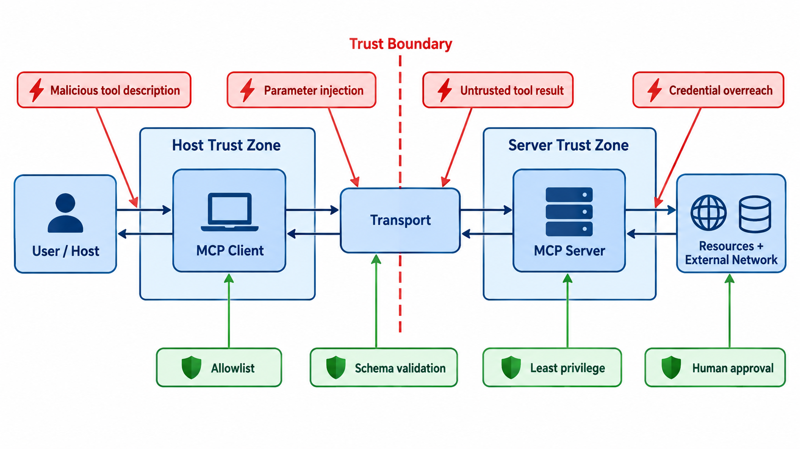

# 练习与验收答案：工具调用与 Agent 协议

## 一、练习参考解

### 1. 写文件工具契约

```json
{
  "$schema": "https://json-schema.org/draft/2020-12/schema",
  "type": "object",
  "properties": {
    "path": {"type": "string", "minLength": 1},
    "content": {"type": "string"},
    "encoding": {"enum": ["utf-8"]},
    "overwrite": {"type": "boolean", "default": false},
    "idempotency_key": {"type": "string", "minLength": 16}
  },
  "required": ["path", "content", "encoding", "overwrite", "idempotency_key"],
  "additionalProperties": false
}
```

成功返回不只写 `success: true`，还应可验证副作用：

```json
{"ok":true,"code":"WRITTEN","bytes":128,"sha256":"...","path":"...","replayed":false}
```

六类错误返回：

| code | 含义 | 可否重试 | 建议处置 |
|---|---|---:|---|
| `INVALID_ARGUMENT` | schema/编码错误 | 否 | 修正参数 |
| `PATH_DENIED` | 越过沙箱或策略 | 否 | 申请授权/换路径 |
| `ALREADY_EXISTS` | 未允许覆盖 | 否 | 用户确认或新文件名 |
| `CONFLICT` | 前置哈希不匹配 | 可条件重试 | 重新读取后合并 |
| `IO_TRANSIENT` | 临时 I/O 故障 | 是 | 指数退避、有限重试 |
| `PARTIAL_WRITE` | 可能已有部分副作用 | 禁止盲重试 | 核验哈希、补偿/原子替换 |

错误对象还应含 `message`、`retryable`、`side_effect_state`、`evidence_id`；不要把堆栈和密钥原样暴露给模型。

### 2. 幂等与补偿

服务端以 `(tool_name, idempotency_key)` 建唯一索引，并保存参数摘要与结果。收到重复请求时：摘要相同则返回原结果并标记 `replayed=true`；摘要不同则返回冲突。写文件可采用“写临时文件→fsync→原子 rename”，再记录内容哈希。

非幂等例子是“发送邮件”。补偿不是让已发邮件消失，而是发撤回/更正通知或创建工单；因此补偿仅恢复业务可接受状态，不等于物理回滚。高风险副作用应在执行前进行预览和人工确认。

### 3. 五个概念的边界

| 概念 | 本质 | 典型内容 |
|---|---|---|
| Function Calling | 模型输出结构化函数参数的能力 | 名称、JSON 参数 |
| MCP Tool | 由 MCP server 暴露的可调用能力 | 工具 schema、结果内容 |
| Skill | 面向 Agent 的工作方法/指令与资源 | `SKILL.md`、脚本、模板 |
| Plugin | 安装和分发能力的本地包 | skills、MCP servers、apps |
| Agent | 持有目标、状态并选择动作的运行实体 | 模型、记忆、工具、策略 |

它们不是同一层级：Agent 可以通过 Function Calling 调 MCP Tool，并遵循 Skill；Plugin 负责把这些能力打包提供。

### 4. MCP 信任边界

#### 标准图



图中的信任区代表不同的身份、凭证和执行权限域，并不表示区内组件天然可信。最重要的边界是 Client 与 Server 之间的协议输入输出，以及 Server 到资源/外网之间的副作用边界。红色框表示攻击面，绿色框表示应落在确定性执行层的控制措施。

```text
用户/Host
  │ 授权、上下文选择
  ▼
MCP Client ──协议消息──> MCP Server ──凭证/网络/文件──> 外部资源
             不可信输入       受限执行域
```

必须威胁建模：恶意工具描述、参数注入、服务器被替换、返回内容间接提示注入、凭证越权、资源 URI 混淆、日志泄密。控制包括服务器身份校验、最小权限、工具 allowlist、参数验证、返回内容标记为不可信、敏感动作确认、审计和速率限制。

| 图中位置 | 主要威胁 | 标准控制 | 验收证据 |
|---|---|---|---|
| Host→Client | 恶意工具描述诱导 | 工具 allowlist、来源校验 | 已批准 server/tool 清单 |
| Client→Transport | 参数注入、重放 | schema 校验、nonce/调用 ID | 拒绝样例与审计事件 |
| Transport→Server | 篡改、身份冒充 | 加密传输、服务器认证 | 握手与身份配置 |
| Server→资源/网络 | 凭证越权、副作用失控 | 最小权限、沙箱、出站限制 | 权限策略与阻断日志 |
| Server→Client 返回 | 间接提示注入 | 不可信内容标记、策略隔离 | 对抗测试与人工门禁 |

## 二、验收问题参考答案

1. **HTTP/tool 成功为何不等于任务成功？** HTTP 200 只说明协议请求被处理；工具 `ok` 只说明契约层动作完成；任务还需要检查副作用和用户目标。例如写入空文件可以是 HTTP 200、工具成功、任务失败。
2. **显式与静默错误？** 显式错误有异常码或失败状态；静默错误返回看似合法但语义错误、漏写或作用于错误对象。后者必须靠后置条件和独立观测发现。
3. **如何串联意图、执行、副作用？** 给计划动作 `action_id`，工具调用携带 `tool_call_id` 与父 `span_id`，系统事件记录 `pid` 和资源，副作用保存对象 ID/哈希；用这些显式键建立边，时间仅作约束。
4. **何时人工审批/沙箱？** 删除、覆盖、支付、发送外部消息、权限变更和执行不可信代码应审批；读操作也可能泄密，网络出口和可读范围仍要沙箱化。审批应展示具体参数与影响，不是笼统“是否允许工具”。

## 三、评分标准（100 分）

契约与错误语义 30；幂等/补偿 20；概念分层 15；信任边界 20；失败测试 15。若没有描述“副作用未知/部分完成”的状态，最高 75 分。

## 四、拓展资料

- [MCP Server 概念与能力](https://modelcontextprotocol.io/specification/draft/server/index)：工具、资源、提示等服务器能力。
- [RFC 9110 §9.2.2](https://www.rfc-editor.org/rfc/rfc9110.html#section-9.2.2)：协议幂等性的准确含义。
- [JSON Schema 2020-12](https://json-schema.org/draft/2020-12/json-schema-core)：工具输入契约的规范基础。
- [Tool Learning with Foundation Models](https://aclanthology.org/2024.emnlp-main.790/)：工具调用失败研究（Tools Fail）。
