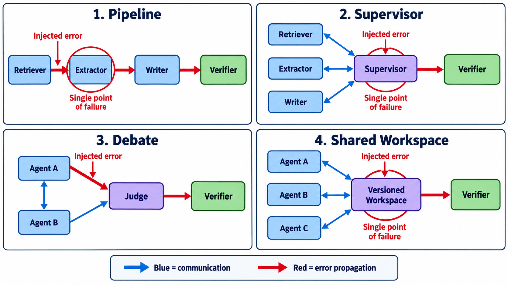

# 练习与验收答案：多 Agent 系统与协作

## 一、同一任务的四种设计

假设任务为“检索 20 篇 AgentOps 论文并生成证据化综述”。

### 标准拓扑图



蓝色边只说明通信或数据依赖，红色边才表示本题注入的错误如何传播。Pipeline 中任何串联的必经阶段都可能成为单点；Supervisor 的集中决策和 Shared Workspace 的中心存储尤其明显；Debate 虽有节点冗余，但若双方共享同一污染源，Judge 仍可能接收相关错误。图中的红圈是需要优先设计验证器、版本控制或降级路径的位置。

| 架构 | 工作流 | 优势 | 失败面 |
|---|---|---|---|
| Pipeline | 检索→筛选→抽取→写作 | 边界清晰、易定位 | 上游错误单向传播 |
| Supervisor | 主管分配/复核多个专家 | 动态调度 | 主管成瓶颈与单点 |
| Debate | 两名分析者给竞争解释，裁判合成 | 暴露分歧 | 成本高、可能共识偏误 |
| Shared workspace | Agent 异步读写证据表 | 并行、松耦合 | 竞态、覆盖、陈旧读取 |

首选基线是 Pipeline；只有在任务需要动态分派时再引入 Supervisor。架构复杂度本身不是贡献，必须证明其带来的质量或可诊断性收益。

## 二、消息、调用与关键路径

Pipeline 教学示例：检索 Agent 1 次模型调用+4 次搜索；抽取 Agent 对 20 篇各 1 次调用；写作 Agent 2 次；验证 Agent 1 次。总工作量是所有调用和，关键路径则是最长依赖链：检索完成→筛选完成→关键论文抽取完成→写作→验证。并行抽取能减少墙钟时间，但不降低总 token。

| 架构 | 关键消息 | 关键路径 | 单点故障 | verifier 位置 |
|---|---|---|---|---|
| Pipeline | 交接产物 | 全阶段串联 | 每个阶段 | 阶段后/末端 |
| Supervisor | 任务/状态/结果 | 主管决策链 | 主管 | 主管外独立 verifier |
| Debate | 论点/反驳/裁决 | 最长辩论轮 | 裁判 | 基于证据的裁判 |
| Workspace | 版本化写入/订阅 | 最慢必需产物 | 存储服务 | 提交前检查 |

### 错误传播注入

注入：“论文 P7 的年份从 2025 改为 2023”。传播图：`检索记录 → 抽取表 → 趋势统计 → 综述结论`。观测四个指标：是否传播、传播深度、被哪个检查发现、修复成本。若最终结论未变，不代表系统可靠，可能只是该错误对当前输出不敏感。

## 三、handoff 契约

```yaml
handoff_id: H-17
from_role: retriever
to_role: extractor
goal: 抽取方法、数据集、指标与局限
artifact_refs: [paper:P7, pdf_hash:...]
claims_allowed: [标题, 作者, 发表地]
evidence_required: page_or_section
known_uncertainties: [附录未获取]
acceptance:
  - 每个主张有定位证据
  - 未找到的信息写 null，不猜测
deadline: 2026-09-24T18:00:00+08:00
schema_version: 1
```

接收方要显式 `accept/reject/request_revision`，不能默认消息发出即交接成功。

## 四、验收问题参考答案

1. **更多 Agent 何时有益？** 当子任务可并行、角色需要不同工具/上下文、交叉验证价值高时可能有益；若任务强耦合或共享上下文巨大，协调噪声、token 和延迟可能抵消收益。应和单 Agent 强基线比较。
2. **通信图与因果图？** 通信边表示消息传过；因果边表示改变源变量会改变结果。消息可能被忽略，也可能多个 Agent 同受外部变量影响，所以前者不能直接当后者。
3. **节点冗余与边冗余？** 节点冗余是多执行者做同一功能；边冗余是信息经多条独立路径传递。若它们共享同一模型、提示或数据，故障可能相关，名义冗余并不独立。
4. **共享工作区如何防竞态？** 乐观锁/版本号、compare-and-swap、不可变事件日志、事务、所有者字段、冲突合并和 lineage。最后写入者获胜只适合无冲突数据，不能作为通用策略。

## 五、评分标准（100 分）

四架构比较 25；调用与关键路径 20；故障注入 20；handoff 契约 20；因果/冗余分析 15。未设置单 Agent 基线，实验设计项减 10 分。

## 六、拓展资料

- [AutoGen](https://arxiv.org/abs/2308.08155)：可对话多 Agent 框架的代表性工作。
- [MultiAgentBench](https://aclanthology.org/2025.acl-long.421/)：多 Agent 协作与协调评测。
- [MAST](https://arxiv.org/abs/2503.13657)：多 Agent 系统失败分类与分析。
