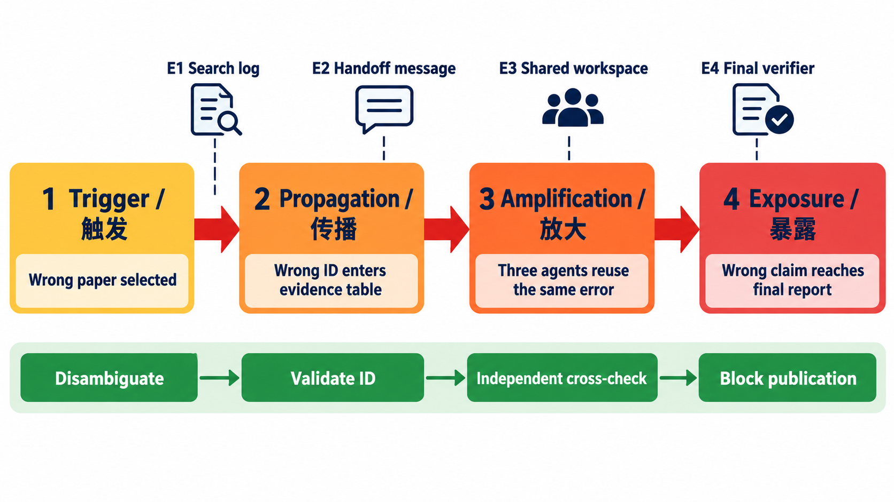

# 练习与验收答案：Agent 故障模式与可靠性

## 一、十个故障样本与分类

| # | 现象 | 层级 | fault（潜在原因） | error（错误状态） | failure（外显失败） |
|---:|---|---|---|---|---|
| 1 | JSON 少字段 | 模型/接口 | 指令约束不足 | 输出不满足 schema | 解析拒绝 |
| 2 | 搜错论文 | 规划 | 查询消歧失败 | 候选集污染 | 综述引用错误 |
| 3 | 工具 200 但空文件 | 工具 | 实现遗漏写入 | 状态与副作用不一致 | 用户拿到空报告 |
| 4 | 无限反思 | 控制 | 无停止条件 | 状态重复 | 预算耗尽 |
| 5 | 超时后重复发信 | 恢复 | 非幂等盲重试 | 两次副作用 | 收件人收到重复邮件 |
| 6 | 多 Agent 覆盖结果 | 协作 | 无版本控制 | 新内容被旧写覆盖 | 证据丢失 |
| 7 | 上下文截断约束 | 记忆 | token 预算不足 | 安全要求不在上下文 | 越权调用 |
| 8 | 时钟漂移乱序 | 观测 | 跨机未同步 | 错误事件顺序 | 误判根因 |
| 9 | trace 采样漏关键边 | 观测 | 采样策略不当 | 图不完整 | 无法归因 |
| 10 | judge 偏爱长答案 | 评测 | rubric/评审偏差 | 分数系统偏移 | 选错方案 |

标注时不要把现象和根因放进同一字段。若证据不足，`root_cause=unknown` 比猜测更专业。

## 二、显式、静默与任务失败

- 显式失败：异常、非零退出码、`status=failed`。
- 静默失败：协议与工具状态正常，但语义、对象或副作用错误。
- 任务失败：用户验收条件不满足；可能由显式或静默错误引起，也可能是需求本身不可行。

例如“搜索接口超时”是显式工具失败；“接口返回过期页面却标 200”是静默数据错误；“最终综述缺核心论文”是任务失败。三者可同时存在，但不是同义词。

## 三、级联链示例

### 标准图



图的上方是每一阶段应保留的证据检查点，下方是对应的阻断措施。一个专业答案不能只画四个框，还要说明错误内容是什么、通过哪个载体传播、在哪一步被多个 Agent 复用、最终怎样转化为用户可见失败。

```text
触发 trigger：检索 Agent 将同名论文 P' 当成目标 P
  → 传播 propagation：错误 paper_id 进入共享证据表
  → 放大 amplification：3 个下游 Agent 重复引用并互相当作一致性
  → 暴露 exposure：最终结论把不存在的方法归给 P
```

可观测指标：首次异常时刻、受影响节点数、传播深度、错误内容复用次数、检测延迟、恢复时间。多 Agent 一致不能自动提高可信度；若共享污染源，一致性只是相关错误。

| 阶段 | 本例状态 | 关键证据 | 最早可阻断点 |
|---|---|---|---|
| 触发 | 选中同名错误论文 | 搜索结果、query、paper ID | 身份消歧 |
| 传播 | 错误 ID 进入证据表 | handoff 消息、写入事件 | ID/元数据校验 |
| 放大 | 三个 Agent 复用同一记录 | 读取 lineage、消息图 | 独立来源交叉核验 |
| 暴露 | 错误主张进入报告 | 最终文本、引用与 verifier 输出 | 阻止发布并回溯修复 |

## 四、三类恢复规则

1. **循环**：状态摘要连续三轮相同或无新增证据，触发 `loop_detected`；允许一次改策略重规划，再失败则停止并交给人。
2. **超时**：只对已知可重试且幂等的动作指数退避；先查询副作用状态。非幂等动作进入 `outcome_unknown`，禁止自动重发。
3. **静默工具错误**：执行后检查独立后置条件（文件哈希、行数、外部资源状态）；不满足时标记 `semantic_failure`，调用替代工具或回滚。

## 五、标注指南与分歧处理

最小字段：`sample_id, observed_failure, layer, fault_candidate, evidence_ids, explicit_or_silent, propagation_parent, confidence, annotator, notes`。两位标注者先独立标注；按预先定义的层级和证据规则计算一致性；分歧由第三人裁决并保留原始标签。不能只报告裁决后的“完美一致”。

## 六、验收问题参考答案

1. **异常与根因区别？** 异常是偏离期望的观测；根因是在给定系统边界和干预定义下，消除后可阻止/显著改变失败的原因。异常可能只是症状。
2. **第一个错误就是根因吗？** 不一定。它可能是最早被观测的症状；更早的配置故障可能未被记录，或该错误即使修复也不改变结果。
3. **重试何时恢复/放大？** 对瞬态、幂等、资源充足的失败可恢复；对确定性错误、限流、非幂等副作用会放大负载、成本或重复操作。
4. **多因如何表达？** 区分必要原因、充分原因、促成因素、触发因素和共同原因；使用候选因果图与干预实验，不强迫每个失败只有一个 root cause。

## 七、评分标准（100 分）

分类准确 25；fault/error/failure 区分 20；级联分析 20；恢复规则 20；标注与分歧 15。把时间最早事件直接标成根因，因果部分不得分。

## 八、拓展资料

- [MAST](https://arxiv.org/abs/2503.13657)：多 Agent 系统失败分类框架。
- [Tools Fail](https://aclanthology.org/2024.emnlp-main.790/)：工具学习中的失败模式。
- [NIST AI Risk Management Framework](https://www.nist.gov/itl/ai-risk-management-framework)：识别、测量与治理 AI 风险的框架。
