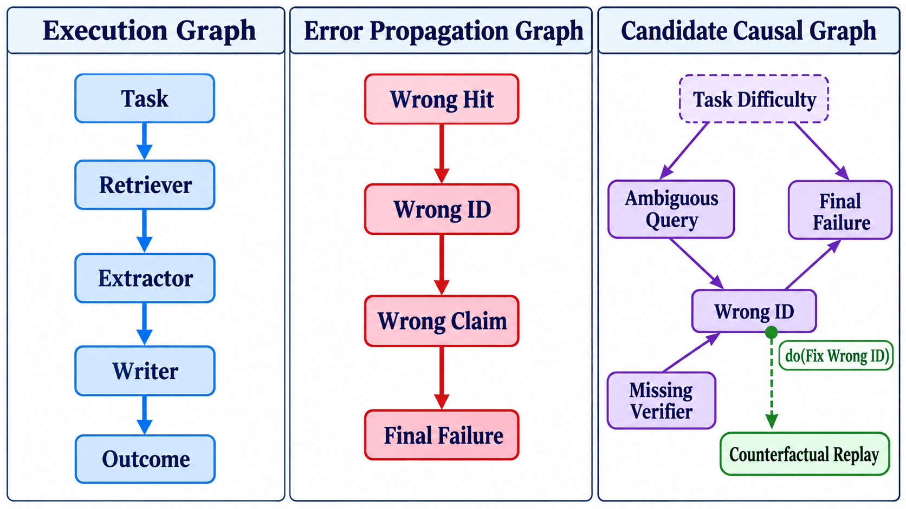

# 练习与验收答案：因果归因与根因诊断

## 一、同一失败的五层标注

案例：研究 Agent 输出错误引用，因为检索 Agent 的结果被摘要 Agent 错配。

| 层级 | 标注对象 | 示例 |
|---|---|---|
| Agent | 角色实例 | `retriever-A` 提供污染候选 |
| Step | 语义步骤 | `S2: resolve-paper-identity` 未消歧 |
| Tool | 具体调用 | `search C17` 返回同名论文 |
| Message | 传递内容 | `M9` 把错误 paper_id 标为已核验 |
| Edge | 关系 | `M9 → extractor input` 传播错误事实 |

这五层不是五个互斥答案。报告应给“定位粒度”和证据，例如：触发在 Tool，未拦截点在 Step，传播载体是 Message/Edge，责任域是 Agent。

## 二、三张图不能混用

### 标准图



左图回答“组件按什么顺序执行”，中图回答“错误状态如何流动”，右图提出“哪些变量可能在干预意义上改变失败”。右图中的 `Task Difficulty` 用虚线表示潜在共同原因；绿色 `do(Fix Wrong ID)` 是干预，不是又一条普通执行边。只有在固定回放条件并设置对照后，反事实 replay 才能为因果主张提供证据。

```text
执行图：Task → Retriever → Extractor → Writer
错误传播图：WrongHit → WrongID → WrongClaim → FinalFailure
候选因果图：AmbiguousQuery ─┐
                            ├→ WrongID → FinalFailure
MissingVerifier ────────────┘
TaskDifficulty → AmbiguousQuery, FinalFailure   # 潜在共同原因
```

执行图来自运行结构；传播图来自错误内容或状态的流动；候选因果图加入未必被执行日志直接观测的机制和混杂变量。只有第三张图适合提出干预问题，但仍需要实验识别。

| 图类型 | 节点语义 | 边语义 | 主要证据 | 不能直接推出 |
|---|---|---|---|---|
| 执行图 | Agent、步骤、调用 | 控制/数据依赖 | trace、调用记录 | 真实因果责任 |
| 传播图 | 错误状态或错误内容 | 污染传递 | 内容差分、message lineage | 消除节点必然恢复 |
| 候选因果图 | 变量与机制 | 假设因果作用 | 领域知识+干预数据 | 未实验时的确定根因 |

## 三、四种反事实操作

| 操作 | 反事实问题 | 保真风险 |
|---|---|---|
| 删除 | 没有错误消息 M9 会怎样？ | 下游可能缺输入，改变任务 |
| 替换 | 把 M9 换成正确 paper_id 会怎样？ | 修复可能携带额外信息 |
| 修复 | 仅改最小错误字段会怎样？ | 最接近局部干预，但需定义最小 |
| 局部 replay | 固定上游和随机种子，从故障点重放 | 外部服务/隐藏状态可能已变 |

推荐主实验：对 `WrongID` 做最小修复，保持其他 trace 输入不变，重复 replay；对照为伪修复（相同长度但不改关键字段）与无干预。结果报告失败率差 `Δ = P(Y=1|do(X=x_bad)) - P(Y=1|do(X=x_fixed))` 及置信区间。

如果修复后成功，只能支持“该变量在该回放环境中具有因果影响”；不能证明它是唯一根因，也不能证明在线系统中效果完全相同。

## 四、多原因角色

示例：`AmbiguousQuery` 产生错候选，`MissingVerifier` 让它通过，`SharedCache` 使其扩散。可表述为：

- 触发因素：歧义查询；
- 促成因素：缺少身份核验；
- 放大因素：共享缓存复用；
- 暴露条件：最终写作信任 `verified=true`；
- 共同原因候选：任务难度同时增加检索歧义与写作错误。

若单独修复任一项都不足以恢复，则可能存在 conjunctive causes。可测试单项和组合干预，而不是强制分配 100% 责任。

## 五、归因报告模板

```yaml
failure: 错误引用进入最终报告
scope: 本次运行、当前环境
candidate_cause: WrongID at message M9
evidence_for: [E12, E19]
evidence_against: [E23]
intervention: replace M9.paper_id only
outcome: 待实验
alternatives: [MissingVerifier, stale cache]
missing_evidence: [search ranking internals]
confidence: not_assessed
```

`confidence` 不是模型主观数字；应与证据强度、重复次数和替代解释检验挂钩。

## 六、验收问题参考答案

1. **更早异常为何不一定是根因？** 可能是无关噪声、共同原因的另一个结果，或虽早但不改变最终失败。时间先后是必要线索，不是充分因果证据。
2. **归因分数与因果效应？** 归因分数通常是模型/规则给出的责任排序；因果效应定义为干预下结果分布的变化。前者可用于筛选候选，不能替代后者。
3. **反事实成功证明什么？** 支持被干预变量在指定 replay 条件下对结果有作用；不证明唯一性、现实可操作性或跨任务泛化。
4. **为何保留竞争解释？** 观测等价、隐藏混杂和证据缺失会让多张因果图都符合当前数据。透明列出替代解释比输出虚假确定性更科学。

## 七、评分标准（100 分）

多层定位 15；图区分 20；反事实设计 30；多因分析 20；证据边界 15。没有对照或未固定回放条件，反事实设计最高得一半分。

## 八、拓展资料

- [Causal Inference in Statistics: A Primer](https://bayes.cs.ucla.edu/PRIMER/)：结构因果模型、干预与反事实基础。
- [Introduction to Causal Inference](https://www.bradyneal.com/causal-inference-course)：DAG、混杂与识别的开放课程。
- [Who & When: Causal Failure Attribution](https://proceedings.mlr.press/v267/zhang25cq.html)：多 Agent 场景中的因果失败归因研究。
