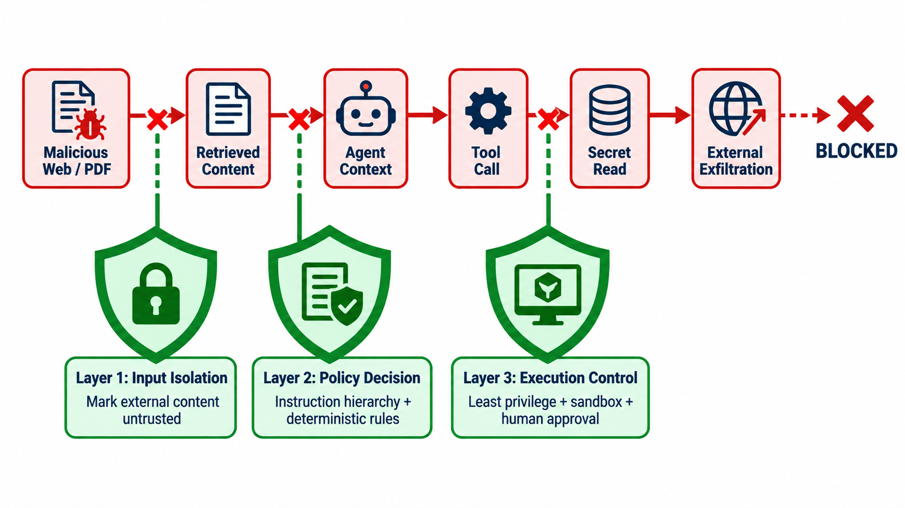

# 练习与验收答案：安全、隐私与治理

## 一、`session.db` 字段分级

分级依赖部署语境，下面是保守基线：

| 等级 | 典型字段 | 理由 | 默认控制 |
|---|---|---|---|
| Public | 脱敏后的聚合指标、公开模型名 | 不指向个人/内部资源 | 可发布前复核 |
| Internal | `pid/ppid`、`comm`、时间、状态、置信度 | 暴露架构与运行模式 | 团队内访问 |
| Sensitive | `cwd`、`argv_json`、host/path、prompt/response、工具输入输出 | 可能含用户名、论文草稿、个人数据、内部路径 | 最小权限、加密、保留期 |
| Secret | API key、cookie、OAuth token、私钥、认证头 | 可直接获得权限 | 原则上不采集；发现即轮换 |

`details_json`、`request_body_json` 等自由文本字段必须按最高可能敏感度处理，不能因为列名普通就归为 Internal。发布时采用 allowlist：只导出明确批准字段，优于不断扩张的敏感词 blocklist。

## 二、最小权限矩阵

| 角色 | 文件读 | 文件写 | Shell | 网络 | 邮件/外部消息 |
|---|---|---|---|---|---|
| Planner | 任务摘要 | 无 | 无 | 无 | 无 |
| Researcher | 指定资料目录 | 缓存目录 | 禁止或只读命令 | allowlist 域名 | 无 |
| Coder | 仓库内 | 工作树内 | 沙箱命令 allowlist | 依赖源 allowlist | 无 |
| Publisher | 已批准产物 | 发布暂存区 | 无 | 发布端点 | 需逐次确认 |
| Observer | 脱敏 trace | 无 | 无 | 无 | 无 |

权限还要限制对象、动作、时间、配额和目的。例如“可写文件”不能等同于“可覆盖任意文件”；网络权限需限制域名、方法、请求体大小与凭证作用域。

## 三、间接提示注入攻击路径

### 标准图



红色路径展示攻击者如何把网页/PDF 中的数据内容转化为 Agent 指令，再利用工具读取秘密并尝试外传。三面绿色盾牌分别在输入、决策和执行层打断攻击链；这是一种纵深防御，任何单层检测漏报都不应直接导致秘密外泄。

```text
恶意网页/PDF中的指令
  → Researcher 将文本放入上下文
  → 模型误把数据当高优先级指令
  → 调用文件/网络工具
  → 读取秘密并外传
```

三层阻断：

1. **输入层**：将外部内容标成不可信数据；隔离指令与证据；检测可疑动作请求，但不把检测器当唯一防线。
2. **决策层**：系统策略不可被检索文本覆盖；对“从数据中产生的新目标”做 provenance 检查；敏感动作需要确定性 policy 和人工确认。
3. **执行层**：工具最小权限、文件/网络沙箱、出站 allowlist、秘密不进入模型上下文、DLP 与审计。即使模型被诱导，也无权完成攻击链。

## 四、公开数据脱敏清单

- 先写数据字典、目的和最小必要字段；删除 prompt/response 原文，能用类别/摘要就不用内容。
- 移除密钥、认证头、cookie、邮箱、用户名、绝对路径、IP 和文档正文；秘密一旦暴露必须轮换，打码不撤销已泄露权限。
- 对稳定 ID 使用每个发布集独立的随机映射；单纯哈希低熵 ID 容易字典反推。
- 时间戳做相对化或分桶，并评估与公开事件交叉识别风险。
- 小群体聚合、稀有错误和自由文本做重识别测试。
- 保存原始→发布字段 lineage、脱敏脚本版本、审批人、许可和删除期限。
- 抽样人工复核，并运行秘密扫描；明确无法保证的剩余风险。

## 五、验收问题参考答案

1. **为什么隐藏 API key 不够？** prompt、路径、网络目标和时间组合仍可泄露个人/项目身份；模型输出还可能复述秘密。数据最小化、访问控制和保留期同样重要。
2. **least privilege 有哪些维度？** 主体、资源、动作、时间、网络目的地、数据范围、调用次数和授权目的；权限应临时、可撤销、可审计。
3. **为何可观测平台是高价值目标？** 它集中模型输入输出、工具参数、系统拓扑、错误栈和凭证痕迹，且往往跨多个服务拥有读取权限；被攻破既泄密也可篡改诊断证据。
4. **何时要求人工确认？** 不可逆或外部可见副作用、支付/删除/权限修改、向新收件人发送消息、越过既定作用域、模型置信不足或副作用状态未知时。确认界面要显示具体对象和影响。

## 六、评分标准（100 分）

字段分级 20；权限矩阵 20；攻击链与防线 25；脱敏治理 20；剩余风险 15。若防御只写“过滤 prompt injection”，最高 50 分。

## 七、拓展资料

- [OWASP Top 10 for LLM Applications](https://genai.owasp.org/llm-top-10/)：提示注入、敏感信息披露和过度代理等风险。
- [OWASP Top 10 for Agentic Applications](https://genai.owasp.org/resource/owasp-top-10-for-agentic-applications-for-2026/)：Agent 目标劫持、工具滥用、身份与权限风险。
- [NIST AI RMF](https://www.nist.gov/itl/ai-risk-management-framework)：Govern、Map、Measure、Manage 风险治理框架。
- [W3C Trace Context §6–7](https://www.w3.org/TR/trace-context/#privacy)：追踪上下文的隐私与安全要求。
